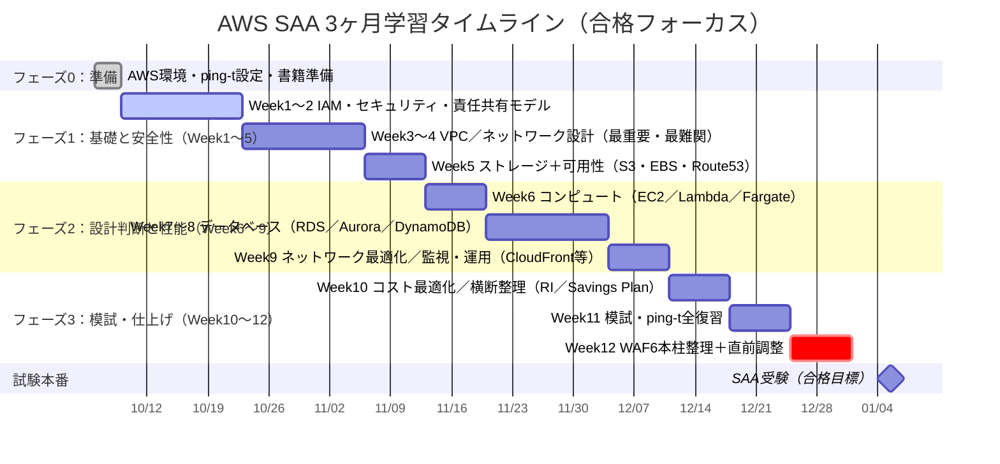

# Timeline

!!! tip "Mermaid でタイムライン表示"
下のガントチャートは **Mermaid** で描画されます。

## 週次チェックリスト

- [ ] Week1-2：IAM 30〜50 問 + 書籍 1〜2 回転
- [ ] Week3-4：VPC 50〜70 問 + ハンズオン
- [ ] Week5：S3/EBS/可用性
- [ ] Week6：Compute
- [ ] Week7-8：DB（RDS/Aurora/DynamoDB）
- [ ] Week9：エッジ/監視
- [ ] Week10：コスト
- [ ] Week11：模試＋総復習
- [ ] Week12：最終調整
